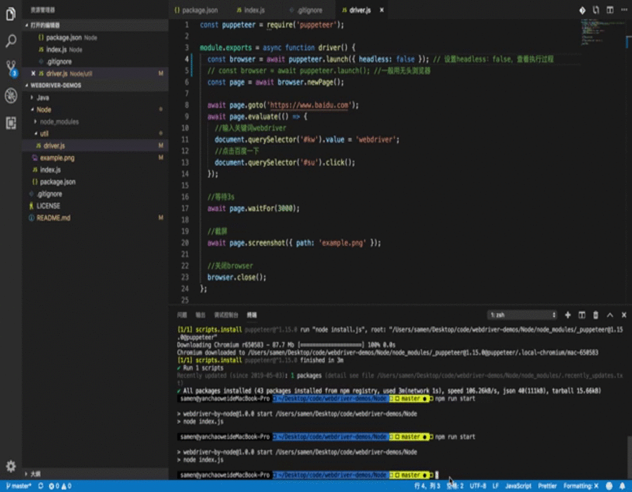

#  webdriver-demos


[English](./README.md) | [简体中文](./README.zh-CN.md)

## 介绍

不同语言实现的 web drivers 示例。主要是支持快速搭建运行，具体业务自行扩展。

## 演示



## 快速开始

### Node 版本

引用 Node 函数库 [puppeteer](https://github.com/GoogleChrome/puppeteer) (它提供了一个高级的 API 控制 chrome 或 chromium，并且默认情况下运行 headless，也可以配置为运行完整非 headless chrome 或chromium 。
```
# clone the project
git clone https://github.com/SamenYan/webdriver-demos.git

# enter the project directory
cd Node

# install dependency
npm install

# run demo application
npm run start
```

### Java 版本

基于 [SpringBoot](https://github.com/ityouknow/spring-boot-examples) 、[Selenium](https://github.com/SeleniumHQ/selenium) 的 Java web 自动化应用。

```
# clone the project 
git clone https://github.com/SamenYan/webdriver-demos.git

# Import Project in IDEA or Eclipse

# project directory
cd Java/demo
```

selenium ：
```
<dependency>
    <groupId>org.seleniumhq.selenium</groupId>
    <artifactId>selenium-java</artifactId>
    <version>2.44.0</version>
</dependency>
```


## License

